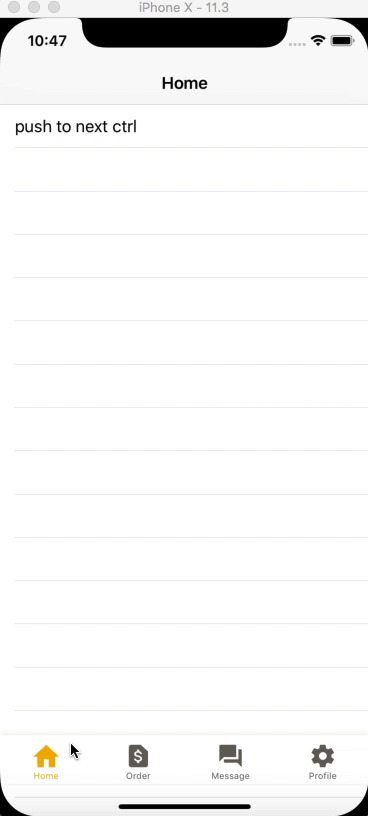

# IMXTabBar
custom TabBar:自定义TabBar控件。

## 一、效果图：



## 二、如何使用

#### # 1. 导入：

1. CocoaPods：

	`` pod 'IMXTabBar', '~> 1.0.0'``
	
2. 手工：

	拖拽`/IMXTabBar/IMXTabBarKit`文件夹至项目中即可。


#### # 2. 使用：

1. 配置文件设置（本例：TabbarConfig.plist）：

	
	
2. 子类化`IMXTabBarViewController`,如`XXTabBarViewController`。

	```
	- (void)viewDidLoad {
    [super viewDidLoad];
    // Do any additional setup after loading the view.
    //1. 获取TabBar配置文件
    NSURL *url = [[NSBundle mainBundle] URLForResource:@"TabbarConfig" withExtension:@"plist"];
    NSArray *itemsArray = [[NSArray alloc] initWithContentsOfURL:url];
    NSMutableArray *tmpItems = [[NSMutableArray alloc] init];
    for (NSDictionary *dic in itemsArray) {
        @autoreleasepool{
            IMXTabbarItemModel *model = [IMXTabbarItemModel new];
            model.selected = [[dic objectForKey:@"selected"] boolValue];
            model.itemImg = [UIImage imageNamed:[dic objectForKey:@"itemImg"]];
            model.itemSelectedImg = [UIImage imageNamed:[dic objectForKey:@"itemSelectedImg"]];
            model.itemTitle = [dic objectForKey:@"itemTitle"];
            model.pageClass = [dic objectForKey:@"pageClass"];
            model.rootNavi = [dic objectForKey:@"rootNavi"];

            model.normalColor = [UIColor colorWithRed:104/255.0 green:101/255.0 blue:94/255.0 alpha:1.0];
            model.highColor = [UIColor colorWithRed:243/255.0 green:178/255.0 blue:2/255.0 alpha:1.0];
            [tmpItems addObject:model];
        }
    }
    self.items = tmpItems;
    [self refreshTabBar:self.items];

	//初始Tabbar选中态（本例index：0）
    IMX_Show_TabBar_AtIndex(0);
	}
	```
	
3. AppDelegate.m中启动设置：

	```
	- (BOOL)application:(UIApplication *)application didFinishLaunchingWithOptions:(NSDictionary *)launchOptions {
    // Override point for customization after application launch.
    UIWindow *window = [[UIWindow alloc] initWithFrame:[[UIScreen mainScreen] bounds]];
    window.backgroundColor = [UIColor whiteColor];
    self.window = window;

    XXTabBarViewController* ctrl = [[XXTabBarViewController alloc] init];
    UINavigationController* rootNavi = [[UINavigationController alloc] initWithRootViewController:ctrl];
    window.rootViewController = rootNavi;

    [window makeKeyAndVisible];
    return YES;
}
	```
	
#### # 3. 导航问题：

1. 基于该TabBar的项目，其基础路由结构如图：

	
	
2. 详情：

	1. 如上图所示：除了TabBar以及对应的items外，其余导航均由rootNavi实现。
	2. 不足：除了一级items展示底部TabBar，其余各级界面不展示。
	3. 具体跳转细节在`TabBarRouteKit`中，不在赘述。


## 三、待添加

1. 配置文件目前只支持本地，后续添加网络加载功能。
2. TabBar对应items可以定制图片功能。如中间图片为了电商促销，特意加大展示。

